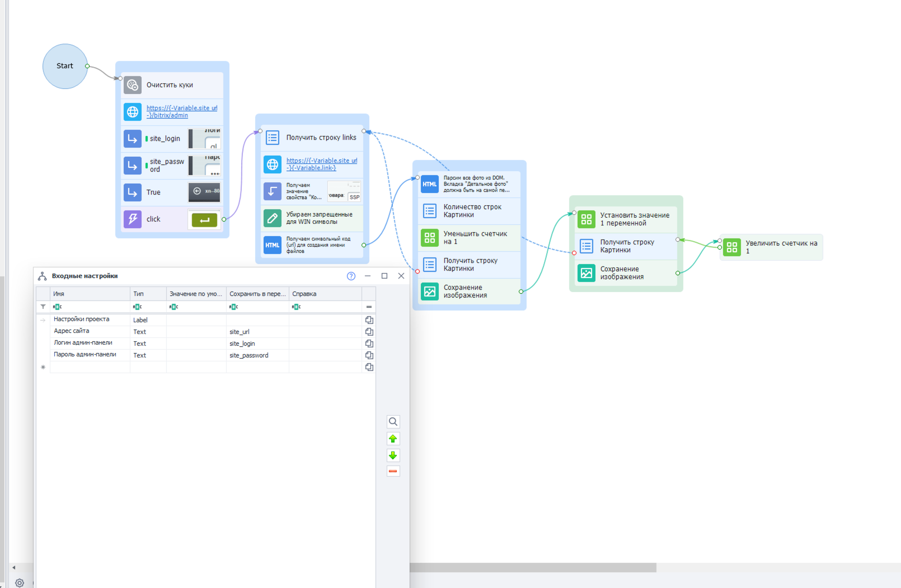

Проект выкачивает картинки из админ-панели Битрикса, сохраняет их в формате символьный_код.jpg на компьютер. Фото
группируются в папки по свойству (нужно создать вручную) "Код товара". Если фото больше одной, то к ним добавляется
постфикс -photo{N}.jpg

***

#Входные данные:

В файл links.txt подаются относильные ссылки на редактирование товаров внутри адмнистративного раздела Битрикс В
настройках проекта (внутри ZP) запоняется URL сайта, логин и пароль от админ-панели.

#Выходные данные:

Папка с названием поля "Код товара", внутри которой лежат выкаченные, но проименованные файлы в формате JPG.

***

#Скриншот проекта:

***

#Видео работы проекта:

[Ссылка на пост в Telegram](https://t.me/c/1246599148/1436)

***

#Пример до работы программы:

zapravochnik-h-1.jpg
Заправочник_H_2.jpg
Заправочник_H_3.jpg

#Пример после работы программы:

adapter-dlya-zameny-zolotnikov-pod-davleniem-h.jpg
adapter-dlya-zameny-zolotnikov-pod-davleniem-h-photo1.jpg 
adapter-dlya-zameny-zolotnikov-pod-davleniem-h-photo2.jpg